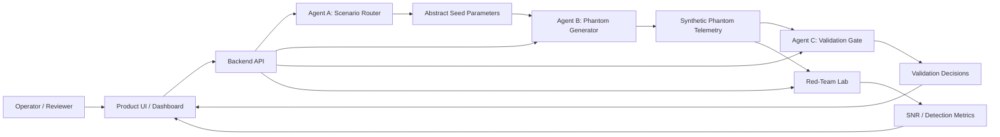

# Logistics Phantom Engineering Blueprint

**Document purpose:** engineer-ready product blueprint for turning the current prototype into a buildable software product.

**Scope:** unclassified synthetic prototype data only. This blueprint does not specify operational deployment, real sensor injection, classified data handling, or deployment-ready deception tooling.

**Related artifacts:**
- [SYNCON Executive Brief](SYNCON_EXECUTIVE_BRIEF.md)
- [SYNCON sample demo package](../examples/syncon-demo/README.md)

---

## 1. Product Intent

Logistics Phantom is a contested-logistics analysis and synthetic telemetry prototype. The product helps a technical team explore how multi-agent workflows could generate, validate, and evaluate synthetic logistics movement patterns while preserving strict separation from protected ground-truth data.

The Phase 1 product shell is named **SYNCON**: Synthetic Convoy Operations Network. Logistics Phantom remains the architecture concept; SYNCON is the runnable product surface built on top of it.

The engineer-ready product should demonstrate three things:

1. A clear multi-agent architecture with explicit data boundaries.
2. A working prototype pipeline that generates synthetic convoy telemetry, validates it against protected ground truth, and evaluates it against a simplified adversary detector.
3. A dashboard or command surface that makes the workflow understandable to product, engineering, and defense stakeholders.

The product is not an operational deception system. It is a buildable portfolio-grade architecture and validation environment.

### Long-Term Operational Vision

The long-term vision for Logistics Phantom is a pre-mission, live-mission, and post-mission convoy support platform. In that mature future state, authorized users would plan a contested logistics movement, generate a large synthetic telemetry shield around the live convoy, monitor validation status during movement, and export an evidence report after the mission showing what was generated, what was rejected, what changed, and what the system observed.

The strongest product idea is not "fake routes" by themselves. The stronger idea is a controlled deception lifecycle:

1. **Pre-mission:** model the route, convoy profile, risk area, phantom multiplier, and validation constraints before the convoy moves.
2. **During mission:** support authorized live convoy activity by maintaining a validated synthetic telemetry shield around protected movement, with human approval, stop controls, and continuous validation.
3. **Post-mission:** generate a beginning-to-end evidence report that explains scenario setup, phantom generation volume, validation decisions, adversary-model results, operator actions, caveats, and lessons learned.

This repository does not implement live convoy operations. Any future live-support mode would require legal authorization, operational authority, cybersecurity accreditation, data classification handling, command-and-control integration review, human-in-the-loop controls, and subject-matter expert validation before implementation.

---

## 2. Target Users

| User | Need |
|------|------|
| Technical product manager | Understand product scope, workflows, risks, and roadmap. |
| Systems architect | Review agent boundaries, trust boundaries, and integration points. |
| Data/ML engineer | Implement synthetic data generation, validation, and detector evaluation. |
| Frontend engineer | Build a single-pane dashboard for runs, metrics, and artifacts. |
| Security reviewer | Verify no real operational data, unsafe claims, or uncontrolled outputs are present. |

---

## 3. Product Surface

The product should expose six primary views.

| View | Purpose | Core Actions |
|------|---------|--------------|
| Mission Setup | Configure synthetic scenario parameters. | Set region bounds, convoy count, phantom multiplier, seed, speed range, and fidelity mode. |
| Scenario Templates | Select reusable synthetic mission profiles. | Choose baseline, dense phantom, validation stress, or high-threat synthetic profiles. |
| Pipeline Runner | Execute Agent A, Agent B, Agent C, and red-team stages. | Start run, stop run, inspect stage status, download artifacts. |
| Validation Dashboard | Show Agent C approval/rejection results. | Inspect rejected phantom IDs, nearest ground-truth distance, latency, false positive checks. |
| Red-Team Lab | Evaluate synthetic swarm realism with simplified adversary models. | Compare multiplier levels, SNR trend, detection rate, detector configuration. |
| Mission Timeline | Show pre-mission, during-mission, and post-mission stages. | Review setup, run events, validation changes, operator actions, and report status. |
| Evidence Report | Produce portfolio-ready output for reviewers. | Export Markdown/JSON summary, test status, validation boundaries, caveats, and lifecycle narrative. |
| Executive Export | Package a completed run for external review. | Generate executive Markdown report, compact artifact bundle, and export manifest. |

Minimum viable product can be a local web dashboard, Streamlit app, FastAPI backend plus React frontend, or CLI plus generated report. A web dashboard is preferred for "ready to use product" presentation.

---

## 4. System Context



### Trust Boundary

Agent A is the only component that may touch protected ground-truth inputs in a future production architecture. In this repository, all inputs are synthetic. Agent B must never receive raw ground-truth coordinates. Agent C may compare phantom data against protected ground truth but must output only validation decisions and sanitized metrics.

---

## 5. Agent Responsibilities

### Agent A: Scenario Router

**Current status:** architecture only.

**Purpose:** convert scenario setup into abstract seed parameters without exposing protected coordinates to Agent B.

**Inputs:**
- Scenario configuration.
- Optional synthetic ground-truth convoy set for prototype runs.

**Outputs:**
- `ScenarioSeed`
- `GroundTruthReference` stored only inside the validation boundary.

**Acceptance criteria:**
- Produces deterministic seeds when `seed` is supplied.
- Emits no raw protected coordinates to Agent B.
- Records scenario metadata for audit and reproducibility.

### Agent B: Phantom Swarm Generator

**Current status:** prototype implemented in `src/prototype/`.

**Purpose:** generate synthetic phantom convoy routes and multimodal telemetry from abstract seed parameters.

**Implemented modules:**
- `agent_b_parallel_swarm_generator.py`
- `bezier_path_generator.py`
- `kinematic_velocity_profiler.py`
- `multimodal_telemetry_generator.py`

**Acceptance criteria:**
- Generates requested phantom count within configured latency budget.
- Produces deterministic output for a fixed seed.
- Routes are smooth, bounded, and internally consistent.
- Speed, fuel, RF, and manifest fields remain cross-modal consistent.

### Agent C: Validation Gate

**Current status:** prototype implemented.

**Purpose:** reject unsafe phantom outputs that collide with friendly ground truth or violate validation rules.

**Implemented modules:**
- `agent_c_validator.py`
- `agent_c_spatial_hash_validator.py`

**Acceptance criteria:**
- Rejects intentionally contaminated phantoms.
- Approves legitimate phantoms outside exclusion boundaries.
- Maintains latency targets for 1,000 and 10,000 phantom batches.
- Handles high-latitude spatial hash edge cases.

### Red-Team Lab

**Current status:** simplified prototype implemented.

**Purpose:** evaluate synthetic swarm realism against a non-operational adversary stand-in.

**Implemented module:**
- `red_team_simulation_lab.py`

**Acceptance criteria:**
- Runs deterministic detection experiments.
- Reports detection rate and SNR by multiplier.
- Labels results as simplified prototype metrics, not operational effectiveness.

---

## 6. Core Data Contracts

These contracts should become typed Python models, JSON schemas, or Pydantic models in the next engineering phase.

### `ScenarioSeed`

```json
{
  "scenario_id": "demo-2026-001",
  "scenario_template": "baseline",
  "seed": 42,
  "region_lat_range": [30.0, 50.0],
  "region_lon_range": [-100.0, -70.0],
  "phantom_count": 1000,
  "waypoints_per_phantom": 8,
  "speed_min_kmh": 35.0,
  "speed_max_kmh": 55.0,
  "fidelity_mode": "prototype"
}
```

### `PhantomConvoy`

```json
{
  "phantom_id": "PHANTOM-000001",
  "scenario_id": "demo-2026-001",
  "waypoints": [
    {"lat": 36.5, "lon": -90.0, "timestamp_s": 0, "speed_kmh": 42.5}
  ],
  "rest_stops": [3, 6],
  "metadata": {
    "generator": "agent_b_parallel_swarm_generator",
    "seed": 42,
    "classification": "UNCLASSIFIED SYNTHETIC PROTOTYPE DATA"
  }
}
```

### `TelemetryBundle`

```json
{
  "phantom_id": "PHANTOM-000001",
  "physical": [],
  "rf": [],
  "logistics_manifest": {
    "cargo_class": "synthetic",
    "payload_tonnes": 12.5,
    "origin_id": "SYN-ORIGIN-01",
    "destination_id": "SYN-DEST-01"
  }
}
```

### `ValidationDecision`

```json
{
  "phantom_id": "PHANTOM-000001",
  "status": "approved",
  "nearest_ground_truth_km": 12.8,
  "rules_triggered": [],
  "validator_version": "agent_c_spatial_hash_validator",
  "latency_ms": 0.08
}
```

### `RedTeamResult`

```json
{
  "scenario_id": "demo-2026-001",
  "multiplier": 100,
  "detector": "IsolationForest",
  "real_detection_rate": 0.023,
  "snr": 0.023,
  "caveat": "Simplified prototype detector; not operational effectiveness."
}
```

---

## 7. API Surface

The product API should be designed around scenario runs.

| Method | Path | Purpose |
|--------|------|---------|
| `POST` | `/api/scenarios` | Create a scenario from setup parameters. |
| `GET` | `/api/scenarios/{scenario_id}` | Fetch scenario metadata and current status. |
| `POST` | `/api/scenarios/{scenario_id}/run` | Start pipeline execution. |
| `GET` | `/api/scenarios/{scenario_id}/runs/{run_id}` | Fetch run status, timings, and stage outputs. |
| `GET` | `/api/scenarios/{scenario_id}/runs/{run_id}/phantoms` | List generated phantom summaries. |
| `GET` | `/api/scenarios/{scenario_id}/runs/{run_id}/validation` | Fetch Agent C validation decisions. |
| `GET` | `/api/scenarios/{scenario_id}/runs/{run_id}/red-team` | Fetch red-team detector metrics. |
| `GET` | `/api/scenarios/{scenario_id}/runs/{run_id}/report` | Export Markdown or JSON evidence report. |
| `POST` | `/api/scenarios/{scenario_id}/runs/{run_id}/export` | Generate an executive export package from an existing run. |

### Backend Acceptance Criteria

- Every run has a unique `run_id`.
- Runs are deterministic for the same `ScenarioSeed`.
- Long-running jobs return status instead of blocking the UI.
- All outputs include classification/scope labels.
- No endpoint returns protected ground-truth coordinates except in local synthetic development mode.

---

## 8. Repository-to-Product Mapping

| Current Artifact | Product Role | Next Engineering Step |
|------------------|--------------|------------------------|
| `agent_c_validator.py` | Baseline validation demo | Keep as standalone demo and regression reference. |
| `src/prototype/agent_b_parallel_swarm_generator.py` | Agent B generator core | Wrap behind service function and typed model. |
| `src/prototype/bezier_path_generator.py` | Route realism engine | Add route strategy interface. |
| `src/prototype/kinematic_velocity_profiler.py` | Movement realism engine | Add terrain/fidelity knobs later. |
| `src/prototype/agent_c_spatial_hash_validator.py` | Agent C optimized validator | Promote to core validation package. |
| `src/prototype/multimodal_telemetry_generator.py` | Telemetry bundle generator | Normalize output schema. |
| `src/prototype/red_team_simulation_lab.py` | Evaluation harness | Convert into repeatable experiment service. |
| `tests/` | Acceptance baseline | Split unit, integration, performance, and product workflow tests. |
| `.github/workflows/` | CI guardrail | Keep correctness and benchmark gates separate. |

---

## 9. Nonfunctional Requirements

| Category | Requirement |
|----------|-------------|
| Reproducibility | Same seed and scenario must produce identical outputs. |
| Safety | All data must remain synthetic unless a future authorized environment is created. |
| Auditability | Every run must record seed, parameters, module versions, and validation summary. |
| Performance | 1,000 phantoms under 5 seconds; 10,000 validation checks under 100 ms in benchmark mode. |
| Portability | Product should run locally on Windows and Linux with documented setup. |
| Observability | Pipeline stages must emit timing, counts, pass/fail, and caveat metadata. |
| Security | Agent B must not receive ground-truth coordinates. Agent C outputs sanitized decisions only. |
| Human Control | Any future live-support mode must include explicit approval gates, stop controls, and immutable operator-action logs. |
| Presentation | Product UI must clearly separate validated prototype behavior from future claims. |

---

## 10. Build Phases

### Phase 1: Product Skeleton

**Goal:** turn the prototype into a runnable product shell.

Deliverables:
- `src/syncon/` package with scenario/run orchestration.
- CLI command: `python syncon.py run --scenario demo`.
- Scenario template command examples: `python syncon.py run --scenario baseline`, `python syncon.py run --scenario validation-stress`, and `python syncon.py run --scenario dense-phantom`.
- Generated JSON artifacts and `REPORT.md` for each run.
- CLI export command: `python syncon.py export --run-id demo-run-001`.
- Generated `SYNCON_EXECUTIVE_REPORT.md` and `EXPORT_MANIFEST.json` for reviewer leave-behinds.
- README quickstart updated for product flow.

Done when:
- A new user can run one command and produce a full evidence report.
- Existing 105-test baseline still passes.

### Phase 2: API and Dashboard

**Goal:** add the ready-to-use product surface.

Deliverables:
- Local dashboard command: `python syncon.py dashboard`.
- Mission Setup, Pipeline Runner, Validation Dashboard, Red-Team Lab, Mission Timeline, and Evidence Report views.
- Artifact links for JSON and Markdown reports.
- Dashboard rendering tests.

Done when:
- A reviewer can configure and run a scenario without touching code.
- Dashboard metrics match backend artifacts.

### Phase 3: Engineering Hardening

**Goal:** make the codebase handoff-ready.

Deliverables:
- Pydantic models or JSON schemas.
- Hardened package structure under `src/syncon/`.
- Unit and integration tests for API and report generation.
- CI gates for lint, tests, coverage, and benchmark smoke tests.

Done when:
- An engineer can extend one module without reverse-engineering prototype scripts.
- CI blocks schema-breaking changes.

### Phase 4: Advanced Simulation

**Goal:** expand realism without making operational claims.

Deliverables:
- Scenario templates.
- Dashboard scenario selector and run-registry scenario labels.
- Pluggable route strategies.
- Pluggable detector strategies.
- Synthetic data export formats.

Done when:
- Multiple scenario profiles can be compared in the dashboard.
- Reports show caveats and validation boundaries automatically.

### Phase 5: Future Authorized Live-Support Architecture

**Goal:** define, but not implement, the architecture required for a future operational mode called Convoy Shield.

Deliverables:
- Live-support architecture document with authority, safety, and data-boundary requirements.
- Human-in-the-loop workflow for approval, parameter changes, pause, resume, and emergency stop.
- Mission timeline model for pre-mission, during-mission, and post-mission events.
- Audit log model for operator actions, generated telemetry counts, validation outcomes, and system warnings.
- Integration checklist for C2, sensor feeds, cybersecurity, classification, legal review, and operational ownership.

Done when:
- The repository clearly distinguishes prototype simulation from future authorized live support.
- An engineer can understand the control plane and safety requirements without being given operational deployment instructions.
- A reviewer can see the product vision: Logistics Phantom starts as a synthetic simulation platform and matures toward controlled convoy-protection support only under proper authority.

---

## 11. Test Strategy

| Test Type | Purpose |
|-----------|---------|
| Unit tests | Validate route generation, kinematics, validation rules, schemas. |
| Integration tests | Validate Agent A -> B -> C -> Red-Team pipeline behavior. |
| Performance tests | Validate latency budgets without coverage instrumentation. |
| Golden report tests | Ensure evidence reports remain stable and readable. |
| UI smoke tests | Confirm dashboard pages render and can run a demo scenario. |
| Safety tests | Assert no real coordinates or operational claims appear in generated artifacts. |

Minimum acceptance before calling the product engineer-ready:

- Full correctness suite passes.
- Performance suite passes or clearly labels local variance.
- One end-to-end scenario produces a report.
- Dashboard or CLI can run without manual code edits.
- All generated artifacts carry unclassified synthetic prototype labels.

---

## 12. Product Demo Script

The final product demo should support this story:

1. Open Logistics Phantom.
2. Select "Synthetic Contested Logistics Demo."
3. Choose mission lifecycle mode: Pre-Mission Plan -> Mission Run -> Post-Mission Report.
4. Set real convoy count to 1 and phantom multiplier to 100x, 1000x, or 10000x in simulation mode.
5. Run pipeline.
6. Watch stage statuses: Scenario -> Phantom Generation -> Validation -> Red-Team Evaluation -> Timeline -> Report.
7. Open validation dashboard and show contaminated phantoms rejected.
8. Open red-team lab and show simplified SNR trend.
9. Open mission timeline and show the beginning-to-end record of setup, generation, validation, and evaluation events.
10. Export evidence report.
11. Explain boundaries: synthetic prototype, no operational telemetry, no deployment claims, future live support requires proper authority.

---

## 13. Engineering Backlog

| Priority | Item | Description |
|----------|------|-------------|
| P0 | Package structure | Move prototype logic into importable product modules. |
| P0 | Typed schemas | Define `ScenarioSeed`, `PhantomConvoy`, `ValidationDecision`, and `RedTeamResult`. |
| P0 | Product runner | Add one command that executes the full pipeline and writes artifacts. |
| P1 | Dashboard | Add local product UI for scenario setup and results. |
| P1 | Report generator | Create Markdown/JSON evidence report from run artifacts. |
| P1 | Safety scanner | Check generated reports for unapproved operational language. |
| P2 | Scenario templates | Add demo scenarios for urban, desert, mountain, and long-haul logistics. |
| P2 | Detector plugins | Add interface for additional non-operational detector stand-ins. |
| P2 | Artifact versioning | Store run metadata and outputs under `runs/{run_id}/`. |
| P2 | Mission timeline | Record pre-mission setup, run events, validation events, and post-mission report status. |
| P3 | Convoy Shield architecture | Define future live-support authority, human-control, audit, and integration requirements without implementing operational deployment. |

---

## 14. Open Questions

1. Should the first product surface be Streamlit for speed or FastAPI plus React for engineering polish?
2. Should the dashboard prioritize architecture storytelling or repeatable experiment execution?
3. Should reports be optimized for GitHub reviewers, hiring managers, or defense product teams?
4. Should Agent A remain architecture-only or be implemented as a synthetic scenario router in Phase 1?
5. Which scenario template best matches the XRDNA conversation: contested logistics convoy, depot resupply, or supply-chain disruption?
6. Should the first product demo emphasize the 10000x phantom convoy concept, or should it start with smaller multipliers and show the scaling path?
7. What exact report audience matters most: technical hiring manager, defense product leader, operational logistics reviewer, or engineering handoff team?

---

## 15. Handoff Definition

This repository is engineer-ready when a new engineer can:

1. Read this blueprint and understand the product boundaries.
2. Run the test suite.
3. Execute one end-to-end synthetic scenario.
4. Inspect generated artifacts.
5. Add a new generator, validator, or detector strategy without rewriting the pipeline.
6. Explain what is validated, what is simulated, and what is future work.

Until those conditions are met, the repository should be described as a strong prototype and architecture artifact, not a complete product.
